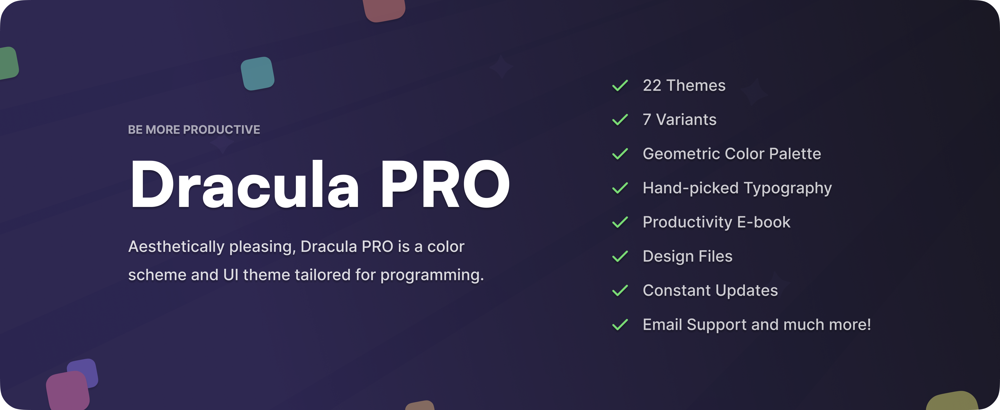

<h3 align="center">
  
   
  Dracula Theme
</h3>

<h6 align="center">
  <a href="https://draculatheme.com">🏰 Website</a>
  ·
  <a href="https://draculatheme.com/blog">📰 Blog</a>
  ·
  <a href="https://draculatheme.com/pro">⚡ PRO</a>
  ·
  <a href="https://draculatheme.com/shop">👕 Shop</a>
  ·
  <a href="https://x.com/draculatheme">𝕏 X</a>
  ·
  <a href="https://www.instagram.com/draculatheme">📸 Instagram</a>
  ·
  <a href="https://draculatheme.com/discord-invite">💬 Discord</a>
</h6>

  The most famous <b>dark & light theme</b> ever created, <b>available everywhere</b>. 🦇

Dracula Theme **minimizes context switching**, so you can stay focused and read your code with ease.

> Every official Dracula theme lives here. Join the clan on our quest to build the best cross-platform theme there is. 🌱

#### Useful links

- 🌃 Learn about the [origin of Dracula Theme.](https://draculatheme.com/about)
- ✨ [Create a new theme](https://draculatheme.com/contribute) using the official color palette.
- 💬 Ask questions in [GitHub Discussions.](https://github.com/dracula/dracula-theme/discussions)
- 🐛 Report bugs in the issues of each theme's repository.

